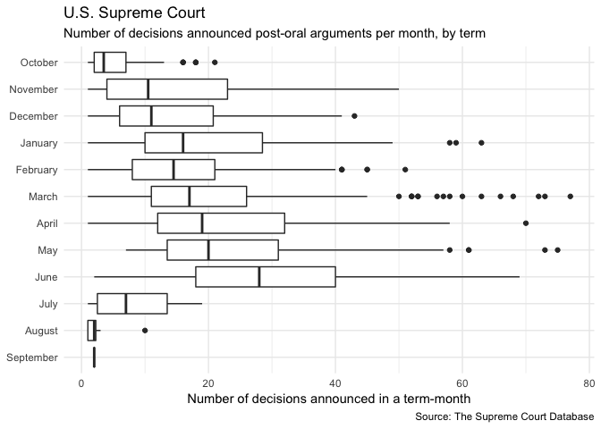

Exploring U.S. Supreme Court Decisions
================
Benjamin Soltoff
October 10, 2018

Get the data
------------

``` r
# load useful packages
library(tidyverse)

# set default theme
theme_set(theme_minimal())
```

``` r
scdbv_mod
```

    ## # A tibble: 79,612 x 61
    ##    caseId docketId caseIssuesId voteId dateDecision decisionType usCite
    ##    <chr>  <chr>    <chr>        <chr>  <chr>               <int> <chr> 
    ##  1 1946-… 1946-00… 1946-001-01… 1946-… 11/18/1946              1 329 U…
    ##  2 1946-… 1946-00… 1946-001-01… 1946-… 11/18/1946              1 329 U…
    ##  3 1946-… 1946-00… 1946-001-01… 1946-… 11/18/1946              1 329 U…
    ##  4 1946-… 1946-00… 1946-001-01… 1946-… 11/18/1946              1 329 U…
    ##  5 1946-… 1946-00… 1946-001-01… 1946-… 11/18/1946              1 329 U…
    ##  6 1946-… 1946-00… 1946-001-01… 1946-… 11/18/1946              1 329 U…
    ##  7 1946-… 1946-00… 1946-001-01… 1946-… 11/18/1946              1 329 U…
    ##  8 1946-… 1946-00… 1946-001-01… 1946-… 11/18/1946              1 329 U…
    ##  9 1946-… 1946-00… 1946-001-01… 1946-… 11/18/1946              1 329 U…
    ## 10 1946-… 1946-00… 1946-002-01… 1946-… 11/18/1946              1 329 U…
    ## # ... with 79,602 more rows, and 54 more variables: sctCite <chr>,
    ## #   ledCite <chr>, lexisCite <chr>, term <int>, naturalCourt <int>,
    ## #   chief <chr>, docket <chr>, caseName <chr>, dateArgument <chr>,
    ## #   dateRearg <chr>, petitioner <int>, petitionerState <int>,
    ## #   respondent <int>, respondentState <int>, jurisdiction <int>,
    ## #   adminAction <int>, adminActionState <int>, threeJudgeFdc <int>,
    ## #   caseOrigin <int>, caseOriginState <int>, caseSource <int>,
    ## #   caseSourceState <int>, lcDisagreement <int>, certReason <int>,
    ## #   lcDisposition <int>, lcDispositionDirection <int>,
    ## #   declarationUncon <int>, caseDisposition <int>,
    ## #   caseDispositionUnusual <int>, partyWinning <int>,
    ## #   precedentAlteration <int>, voteUnclear <int>, issue <int>,
    ## #   issueArea <int>, decisionDirection <int>,
    ## #   decisionDirectionDissent <int>, authorityDecision1 <int>,
    ## #   authorityDecision2 <int>, lawType <int>, lawSupp <int>,
    ## #   lawMinor <chr>, majOpinWriter <int>, majOpinAssigner <int>,
    ## #   splitVote <int>, majVotes <int>, minVotes <int>, justice <int>,
    ## #   justiceName <chr>, vote <int>, opinion <int>, direction <int>,
    ## #   majority <int>, firstAgreement <int>, secondAgreement <int>

``` r
scdbv_leg
```

    ## # A tibble: 172,213 x 61
    ##    caseId docketId caseIssuesId voteId dateDecision decisionType usCite
    ##    <chr>  <chr>    <chr>        <chr>  <chr>               <int> <chr> 
    ##  1 1791-… 1791-00… 1791-001-01… 1791-… 8/3/1791                6 2 U.S…
    ##  2 1791-… 1791-00… 1791-001-01… 1791-… 8/3/1791                6 2 U.S…
    ##  3 1791-… 1791-00… 1791-001-01… 1791-… 8/3/1791                6 2 U.S…
    ##  4 1791-… 1791-00… 1791-001-01… 1791-… 8/3/1791                6 2 U.S…
    ##  5 1791-… 1791-00… 1791-001-01… 1791-… 8/3/1791                6 2 U.S…
    ##  6 1791-… 1791-00… 1791-002-01… 1791-… 8/3/1791                2 2 U.S…
    ##  7 1791-… 1791-00… 1791-002-01… 1791-… 8/3/1791                2 2 U.S…
    ##  8 1791-… 1791-00… 1791-002-01… 1791-… 8/3/1791                2 2 U.S…
    ##  9 1791-… 1791-00… 1791-002-01… 1791-… 8/3/1791                2 2 U.S…
    ## 10 1791-… 1791-00… 1791-002-01… 1791-… 8/3/1791                2 2 U.S…
    ## # ... with 172,203 more rows, and 54 more variables: sctCite <chr>,
    ## #   ledCite <chr>, lexisCite <chr>, term <int>, naturalCourt <int>,
    ## #   chief <chr>, docket <chr>, caseName <chr>, dateArgument <chr>,
    ## #   dateRearg <chr>, petitioner <int>, petitionerState <int>,
    ## #   respondent <int>, respondentState <int>, jurisdiction <int>,
    ## #   adminAction <dbl>, adminActionState <dbl>, threeJudgeFdc <int>,
    ## #   caseOrigin <int>, caseOriginState <int>, caseSource <int>,
    ## #   caseSourceState <int>, lcDisagreement <int>, certReason <int>,
    ## #   lcDisposition <int>, lcDispositionDirection <int>,
    ## #   declarationUncon <int>, caseDisposition <int>,
    ## #   caseDispositionUnusual <int>, partyWinning <int>,
    ## #   precedentAlteration <int>, voteUnclear <int>, issue <int>,
    ## #   issueArea <int>, decisionDirection <int>,
    ## #   decisionDirectionDissent <int>, authorityDecision1 <int>,
    ## #   authorityDecision2 <int>, lawType <int>, lawSupp <int>,
    ## #   lawMinor <chr>, majOpinWriter <int>, majOpinAssigner <int>,
    ## #   splitVote <int>, majVotes <int>, minVotes <int>, justice <int>,
    ## #   justiceName <chr>, vote <int>, opinion <int>, direction <int>,
    ## #   majority <int>, firstAgreement <int>, secondAgreement <int>

Combine the datasets
--------------------

    ## # A tibble: 251,825 x 61
    ##    caseId docketId caseIssuesId voteId dateDecision decisionType usCite
    ##    <chr>  <chr>    <chr>        <chr>  <chr>               <int> <chr> 
    ##  1 1946-… 1946-00… 1946-001-01… 1946-… 11/18/1946              1 329 U…
    ##  2 1946-… 1946-00… 1946-001-01… 1946-… 11/18/1946              1 329 U…
    ##  3 1946-… 1946-00… 1946-001-01… 1946-… 11/18/1946              1 329 U…
    ##  4 1946-… 1946-00… 1946-001-01… 1946-… 11/18/1946              1 329 U…
    ##  5 1946-… 1946-00… 1946-001-01… 1946-… 11/18/1946              1 329 U…
    ##  6 1946-… 1946-00… 1946-001-01… 1946-… 11/18/1946              1 329 U…
    ##  7 1946-… 1946-00… 1946-001-01… 1946-… 11/18/1946              1 329 U…
    ##  8 1946-… 1946-00… 1946-001-01… 1946-… 11/18/1946              1 329 U…
    ##  9 1946-… 1946-00… 1946-001-01… 1946-… 11/18/1946              1 329 U…
    ## 10 1946-… 1946-00… 1946-002-01… 1946-… 11/18/1946              1 329 U…
    ## # ... with 251,815 more rows, and 54 more variables: sctCite <chr>,
    ## #   ledCite <chr>, lexisCite <chr>, term <int>, naturalCourt <int>,
    ## #   chief <chr>, docket <chr>, caseName <chr>, dateArgument <chr>,
    ## #   dateRearg <chr>, petitioner <int>, petitionerState <int>,
    ## #   respondent <int>, respondentState <int>, jurisdiction <int>,
    ## #   adminAction <dbl>, adminActionState <dbl>, threeJudgeFdc <int>,
    ## #   caseOrigin <int>, caseOriginState <int>, caseSource <int>,
    ## #   caseSourceState <int>, lcDisagreement <int>, certReason <int>,
    ## #   lcDisposition <int>, lcDispositionDirection <int>,
    ## #   declarationUncon <int>, caseDisposition <int>,
    ## #   caseDispositionUnusual <int>, partyWinning <int>,
    ## #   precedentAlteration <int>, voteUnclear <int>, issue <int>,
    ## #   issueArea <int>, decisionDirection <int>,
    ## #   decisionDirectionDissent <int>, authorityDecision1 <int>,
    ## #   authorityDecision2 <int>, lawType <int>, lawSupp <int>,
    ## #   lawMinor <chr>, majOpinWriter <int>, majOpinAssigner <int>,
    ## #   splitVote <int>, majVotes <int>, minVotes <int>, justice <int>,
    ## #   justiceName <chr>, vote <int>, opinion <int>, direction <int>,
    ## #   majority <int>, firstAgreement <int>, secondAgreement <int>

Recode variables as you find necessary
--------------------------------------

What percentage of cases in each term are decided by a one-vote margin (i.e. 5-4, 4-3, etc.)
--------------------------------------------------------------------------------------------


In each term he served on the Court, in what percentage of cases was Justice Antonin Scalia in the majority?
------------------------------------------------------------------------------------------------------------


Create a graph similar to above that compares the percentage for all cases versus non-unanimous cases (i.e. there was at least one dissenting vote)
---------------------------------------------------------------------------------------------------------------------------------------------------


In each term, what percentage of cases were decided in the conservative direction?
----------------------------------------------------------------------------------


In each term, how many of the term's published decisions were announced in a given month?
-----------------------------------------------------------------------------------------



The Chief Justice is frequently seen as capable of influencing the ideological direction of the Court. Create a graph similar to the one above that also incorporates information on who was the Chief Justice during the term.
-------------------------------------------------------------------------------------------------------------------------------------------------------------------------------------------------------------------------------

#### Solution using facets (not too much more difficult)


#### Solution using facets and showing whole data on each facet (getting harder)


#### Solution shading original graph with color-coded eras of Chief Justices (attempt at your own risk)


Session info
------------

``` r
devtools::session_info()
```

    ##  setting  value                       
    ##  version  R version 3.5.0 (2018-04-23)
    ##  system   x86_64, darwin15.6.0        
    ##  ui       X11                         
    ##  language (EN)                        
    ##  collate  en_US.UTF-8                 
    ##  tz       America/Chicago             
    ##  date     2018-07-30                  
    ## 
    ##  package    * version date       source        
    ##  assertthat   0.2.0   2017-04-11 CRAN (R 3.5.0)
    ##  backports    1.1.2   2017-12-13 CRAN (R 3.5.0)
    ##  base       * 3.5.0   2018-04-24 local         
    ##  bindr        0.1.1   2018-03-13 CRAN (R 3.5.0)
    ##  bindrcpp   * 0.2.2   2018-03-29 CRAN (R 3.5.0)
    ##  broom        0.5.0   2018-07-17 CRAN (R 3.5.0)
    ##  cellranger   1.1.0   2016-07-27 CRAN (R 3.5.0)
    ##  cli          1.0.0   2017-11-05 CRAN (R 3.5.0)
    ##  codetools    0.2-15  2016-10-05 CRAN (R 3.5.0)
    ##  colorspace   1.3-2   2016-12-14 CRAN (R 3.5.0)
    ##  compiler     3.5.0   2018-04-24 local         
    ##  crayon       1.3.4   2017-09-16 CRAN (R 3.5.0)
    ##  datasets   * 3.5.0   2018-04-24 local         
    ##  devtools     1.13.6  2018-06-27 CRAN (R 3.5.0)
    ##  digest       0.6.15  2018-01-28 CRAN (R 3.5.0)
    ##  dplyr      * 0.7.6   2018-06-29 cran (@0.7.6) 
    ##  evaluate     0.11    2018-07-17 CRAN (R 3.5.0)
    ##  fansi        0.2.3   2018-05-06 CRAN (R 3.5.0)
    ##  forcats    * 0.3.0   2018-02-19 CRAN (R 3.5.0)
    ##  ggplot2    * 3.0.0   2018-07-03 CRAN (R 3.5.0)
    ##  glue         1.3.0   2018-07-17 CRAN (R 3.5.0)
    ##  graphics   * 3.5.0   2018-04-24 local         
    ##  grDevices  * 3.5.0   2018-04-24 local         
    ##  grid         3.5.0   2018-04-24 local         
    ##  gtable       0.2.0   2016-02-26 CRAN (R 3.5.0)
    ##  haven        1.1.2   2018-06-27 CRAN (R 3.5.0)
    ##  hms          0.4.2   2018-03-10 CRAN (R 3.5.0)
    ##  htmltools    0.3.6   2017-04-28 CRAN (R 3.5.0)
    ##  httr         1.3.1   2017-08-20 CRAN (R 3.5.0)
    ##  jsonlite     1.5     2017-06-01 CRAN (R 3.5.0)
    ##  knitr        1.20    2018-02-20 CRAN (R 3.5.0)
    ##  labeling     0.3     2014-08-23 CRAN (R 3.5.0)
    ##  lattice      0.20-35 2017-03-25 CRAN (R 3.5.0)
    ##  lazyeval     0.2.1   2017-10-29 CRAN (R 3.5.0)
    ##  lubridate    1.7.4   2018-04-11 CRAN (R 3.5.0)
    ##  magrittr     1.5     2014-11-22 CRAN (R 3.5.0)
    ##  memoise      1.1.0   2017-04-21 CRAN (R 3.5.0)
    ##  methods    * 3.5.0   2018-04-24 local         
    ##  modelr       0.1.2   2018-05-11 CRAN (R 3.5.0)
    ##  munsell      0.5.0   2018-06-12 CRAN (R 3.5.0)
    ##  nlme         3.1-137 2018-04-07 CRAN (R 3.5.0)
    ##  pillar       1.3.0   2018-07-14 CRAN (R 3.5.0)
    ##  pkgconfig    2.0.1   2017-03-21 CRAN (R 3.5.0)
    ##  plyr         1.8.4   2016-06-08 CRAN (R 3.5.0)
    ##  purrr      * 0.2.5   2018-05-29 CRAN (R 3.5.0)
    ##  R6           2.2.2   2017-06-17 CRAN (R 3.5.0)
    ##  Rcpp         0.12.18 2018-07-23 CRAN (R 3.5.0)
    ##  readr      * 1.1.1   2017-05-16 CRAN (R 3.5.0)
    ##  readxl       1.1.0   2018-04-20 CRAN (R 3.5.0)
    ##  rlang        0.2.1   2018-05-30 CRAN (R 3.5.0)
    ##  rmarkdown    1.10    2018-06-11 CRAN (R 3.5.0)
    ##  rprojroot    1.3-2   2018-01-03 CRAN (R 3.5.0)
    ##  rstudioapi   0.7     2017-09-07 CRAN (R 3.5.0)
    ##  rvest        0.3.2   2016-06-17 CRAN (R 3.5.0)
    ##  scales       0.5.0   2017-08-24 CRAN (R 3.5.0)
    ##  stats      * 3.5.0   2018-04-24 local         
    ##  stringi      1.2.4   2018-07-20 CRAN (R 3.5.0)
    ##  stringr    * 1.3.1   2018-05-10 CRAN (R 3.5.0)
    ##  tibble     * 1.4.2   2018-01-22 CRAN (R 3.5.0)
    ##  tidyr      * 0.8.1   2018-05-18 CRAN (R 3.5.0)
    ##  tidyselect   0.2.4   2018-02-26 CRAN (R 3.5.0)
    ##  tidyverse  * 1.2.1   2017-11-14 CRAN (R 3.5.0)
    ##  tools        3.5.0   2018-04-24 local         
    ##  utf8         1.1.4   2018-05-24 CRAN (R 3.5.0)
    ##  utils      * 3.5.0   2018-04-24 local         
    ##  withr        2.1.2   2018-03-15 CRAN (R 3.5.0)
    ##  xml2         1.2.0   2018-01-24 CRAN (R 3.5.0)
    ##  yaml         2.1.19  2018-05-01 CRAN (R 3.5.0)
