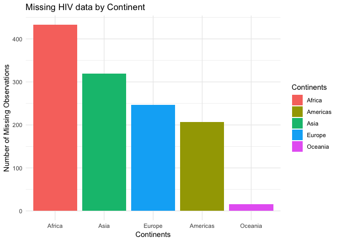

Joining Gapminder Data
================
Jess Robinson

Get the original data
=====================

``` r
library(tidyverse)
```

    ## ── Attaching packages ──────────────────────────────────────────────────── tidyverse 1.2.1 ──

    ## ✔ ggplot2 3.0.0     ✔ purrr   0.2.5
    ## ✔ tibble  1.4.2     ✔ dplyr   0.7.6
    ## ✔ tidyr   0.8.1     ✔ stringr 1.3.1
    ## ✔ readr   1.1.1     ✔ forcats 0.3.0

    ## Warning: package 'dplyr' was built under R version 3.5.1

    ## ── Conflicts ─────────────────────────────────────────────────────── tidyverse_conflicts() ──
    ## ✖ dplyr::filter() masks stats::filter()
    ## ✖ dplyr::lag()    masks stats::lag()

``` r
library(gapminder)
library(here)
```

    ## here() starts at /Users/Jessrobinson42/Desktop/CFSS/HW03

``` r
theme_set(theme_minimal())
gapminder
```

    ## # A tibble: 1,704 x 6
    ##    country     continent  year lifeExp      pop gdpPercap
    ##    <fct>       <fct>     <int>   <dbl>    <int>     <dbl>
    ##  1 Afghanistan Asia       1952    28.8  8425333      779.
    ##  2 Afghanistan Asia       1957    30.3  9240934      821.
    ##  3 Afghanistan Asia       1962    32.0 10267083      853.
    ##  4 Afghanistan Asia       1967    34.0 11537966      836.
    ##  5 Afghanistan Asia       1972    36.1 13079460      740.
    ##  6 Afghanistan Asia       1977    38.4 14880372      786.
    ##  7 Afghanistan Asia       1982    39.9 12881816      978.
    ##  8 Afghanistan Asia       1987    40.8 13867957      852.
    ##  9 Afghanistan Asia       1992    41.7 16317921      649.
    ## 10 Afghanistan Asia       1997    41.8 22227415      635.
    ## # ... with 1,694 more rows

Import the HIV data
===================

``` r
#loading HIV data
hivdata <-read_csv(file = here("data", "gapminder_hiv.csv"))
```

    ## Parsed with column specification:
    ## cols(
    ##   country = col_character(),
    ##   year = col_integer(),
    ##   hivRate = col_double()
    ## )

What is the relationship between HIV prevalence and life expectancy?
====================================================================

``` r
#join data
hivprevlife <- inner_join(hivdata, gapminder)
```

    ## Joining, by = c("country", "year")

    ## Warning: Column `country` joining character vector and factor, coercing
    ## into character vector

``` r
#plot data
ggplot(data = hivprevlife, mapping = aes(x=hivRate, y=lifeExp)) +
    scale_x_log10() +
    geom_point() +
    geom_smooth() +
    xlab("HIV Rate (log)") +
    ylab("Life Expectancy")
```

    ## `geom_smooth()` using method = 'loess' and formula 'y ~ x'


For this question, I chose to use an inner join, because I wanted to see only observations where there was data on both HIV prevalence and life expectancy. For countries with an logarithmic HIV rate above 0.1, the relationship between HIV prevalence and life expectancy is negative, with higher rates of HIV prevalence associated with lower life expectancies.

Which continents have the most countries with missing HIV data?
===============================================================

``` r
#anti-joining data
missinghiv <- anti_join(gapminder, hivdata)
```

    ## Joining, by = c("country", "year")

    ## Warning: Column `country` joining factor and character vector, coercing
    ## into character vector

``` r
#plotting missing data
missinghiv %>%
 count(continent) %>%
  filter(!is.na(continent)) %>%
  ggplot(mapping = aes(x = reorder(continent, -n), y=n, fill=continent)) +
    geom_col() +
    labs(title = "Missing HIV data by Continent",
    x= "Continents",
    y = "Number of Missing Observations",
    fill = "Continents")
```



For this question, I chose to use an anti-join, because I wanted to see observations that had missing HIV data. Africa, followed by Asia and then Europe, have the greatest number of missing HIV data observations.

Session info
------------

``` r
devtools::session_info()
```

    ## ─ Session info ──────────────────────────────────────────────────────────
    ##  setting  value                       
    ##  version  R version 3.5.0 (2018-04-23)
    ##  os       OS X El Capitan 10.11.6     
    ##  system   x86_64, darwin15.6.0        
    ##  ui       X11                         
    ##  language (EN)                        
    ##  collate  en_US.UTF-8                 
    ##  ctype    en_US.UTF-8                 
    ##  tz       America/Chicago             
    ##  date     2019-04-22                  
    ## 
    ## ─ Packages ──────────────────────────────────────────────────────────────
    ##  package     * version date       lib source        
    ##  assertthat    0.2.0   2017-04-11 [1] CRAN (R 3.5.0)
    ##  backports     1.1.2   2017-12-13 [1] CRAN (R 3.5.0)
    ##  base64enc     0.1-3   2015-07-28 [1] CRAN (R 3.5.0)
    ##  bindr         0.1.1   2018-03-13 [1] CRAN (R 3.5.0)
    ##  bindrcpp    * 0.2.2   2018-03-29 [1] CRAN (R 3.5.0)
    ##  broom         0.5.0   2018-07-17 [1] CRAN (R 3.5.0)
    ##  callr         3.0.0   2018-08-24 [1] CRAN (R 3.5.0)
    ##  cellranger    1.1.0   2016-07-27 [1] CRAN (R 3.5.0)
    ##  cli           1.0.0   2017-11-05 [1] CRAN (R 3.5.0)
    ##  colorspace    1.3-2   2016-12-14 [1] CRAN (R 3.5.0)
    ##  crayon        1.3.4   2017-09-16 [1] CRAN (R 3.5.0)
    ##  desc          1.2.0   2018-05-01 [1] CRAN (R 3.5.0)
    ##  devtools      2.0.1   2018-10-26 [1] CRAN (R 3.5.0)
    ##  digest        0.6.15  2018-01-28 [1] CRAN (R 3.5.0)
    ##  dplyr       * 0.7.6   2018-06-29 [1] CRAN (R 3.5.1)
    ##  evaluate      0.10.1  2017-06-24 [1] CRAN (R 3.5.0)
    ##  forcats     * 0.3.0   2018-02-19 [1] CRAN (R 3.5.0)
    ##  fs            1.2.6   2018-08-23 [1] CRAN (R 3.5.0)
    ##  gapminder   * 0.3.0   2017-10-31 [1] CRAN (R 3.5.0)
    ##  ggplot2     * 3.0.0   2018-07-03 [1] CRAN (R 3.5.0)
    ##  glue          1.2.0   2017-10-29 [1] CRAN (R 3.5.0)
    ##  gtable        0.2.0   2016-02-26 [1] CRAN (R 3.5.0)
    ##  haven         1.1.2   2018-06-27 [1] CRAN (R 3.5.0)
    ##  here        * 0.1     2017-05-28 [1] CRAN (R 3.5.0)
    ##  hms           0.4.2   2018-03-10 [1] CRAN (R 3.5.0)
    ##  htmltools     0.3.6   2017-04-28 [1] CRAN (R 3.5.0)
    ##  httr          1.3.1   2017-08-20 [1] CRAN (R 3.5.0)
    ##  jsonlite      1.5     2017-06-01 [1] CRAN (R 3.5.0)
    ##  knitr         1.20    2018-02-20 [1] CRAN (R 3.5.0)
    ##  labeling      0.3     2014-08-23 [1] CRAN (R 3.5.0)
    ##  lattice       0.20-35 2017-03-25 [1] CRAN (R 3.5.0)
    ##  lazyeval      0.2.1   2017-10-29 [1] CRAN (R 3.5.0)
    ##  lubridate     1.7.4   2018-04-11 [1] CRAN (R 3.5.0)
    ##  magrittr      1.5     2014-11-22 [1] CRAN (R 3.5.0)
    ##  memoise       1.1.0   2017-04-21 [1] CRAN (R 3.5.0)
    ##  modelr        0.1.2   2018-05-11 [1] CRAN (R 3.5.0)
    ##  munsell       0.5.0   2018-06-12 [1] CRAN (R 3.5.0)
    ##  nlme          3.1-137 2018-04-07 [1] CRAN (R 3.5.0)
    ##  pillar        1.2.3   2018-05-25 [1] CRAN (R 3.5.0)
    ##  pkgbuild      1.0.2   2018-10-16 [1] CRAN (R 3.5.0)
    ##  pkgconfig     2.0.1   2017-03-21 [1] CRAN (R 3.5.0)
    ##  pkgload       1.0.2   2018-10-29 [1] CRAN (R 3.5.0)
    ##  plyr          1.8.4   2016-06-08 [1] CRAN (R 3.5.0)
    ##  prettyunits   1.0.2   2015-07-13 [1] CRAN (R 3.5.0)
    ##  processx      3.2.0   2018-08-16 [1] CRAN (R 3.5.0)
    ##  ps            1.1.0   2018-08-10 [1] CRAN (R 3.5.0)
    ##  purrr       * 0.2.5   2018-05-29 [1] CRAN (R 3.5.0)
    ##  R6            2.2.2   2017-06-17 [1] CRAN (R 3.5.0)
    ##  Rcpp          0.12.17 2018-05-18 [1] CRAN (R 3.5.0)
    ##  readr       * 1.1.1   2017-05-16 [1] CRAN (R 3.5.0)
    ##  readxl        1.1.0   2018-04-20 [1] CRAN (R 3.5.0)
    ##  remotes       2.0.2   2018-10-30 [1] CRAN (R 3.5.0)
    ##  rlang         0.3.0.1 2018-10-25 [1] CRAN (R 3.5.0)
    ##  rmarkdown     1.10    2018-06-11 [1] CRAN (R 3.5.0)
    ##  rprojroot     1.3-2   2018-01-03 [1] CRAN (R 3.5.0)
    ##  rstudioapi    0.8     2018-10-02 [1] CRAN (R 3.5.0)
    ##  rvest         0.3.2   2016-06-17 [1] CRAN (R 3.5.0)
    ##  scales        0.5.0   2017-08-24 [1] CRAN (R 3.5.0)
    ##  sessioninfo   1.1.1   2018-11-05 [1] CRAN (R 3.5.0)
    ##  stringi       1.2.3   2018-06-12 [1] CRAN (R 3.5.0)
    ##  stringr     * 1.3.1   2018-05-10 [1] CRAN (R 3.5.0)
    ##  testthat      2.0.0   2017-12-13 [1] CRAN (R 3.5.0)
    ##  tibble      * 1.4.2   2018-01-22 [1] CRAN (R 3.5.0)
    ##  tidyr       * 0.8.1   2018-05-18 [1] CRAN (R 3.5.0)
    ##  tidyselect    0.2.4   2018-02-26 [1] CRAN (R 3.5.0)
    ##  tidyverse   * 1.2.1   2017-11-14 [1] CRAN (R 3.5.0)
    ##  usethis       1.4.0   2018-08-14 [1] CRAN (R 3.5.0)
    ##  utf8          1.1.4   2018-05-24 [1] CRAN (R 3.5.0)
    ##  withr         2.1.2   2018-03-15 [1] CRAN (R 3.5.0)
    ##  xml2          1.2.0   2018-01-24 [1] CRAN (R 3.5.0)
    ##  yaml          2.1.19  2018-05-01 [1] CRAN (R 3.5.0)
    ## 
    ## [1] /Library/Frameworks/R.framework/Versions/3.5/Resources/library
