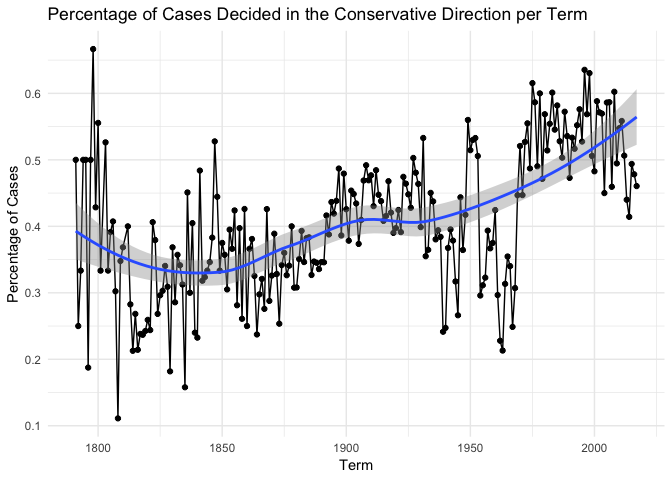

Exploring U.S. Supreme Court Decisions
================
Jess Robinson

Get the data
------------

``` r
# load useful packages
library(tidyverse)
```

    ## ── Attaching packages ──────────────────────────────────────────────────── tidyverse 1.2.1 ──

    ## ✔ ggplot2 3.0.0     ✔ purrr   0.2.5
    ## ✔ tibble  1.4.2     ✔ dplyr   0.7.6
    ## ✔ tidyr   0.8.1     ✔ stringr 1.3.1
    ## ✔ readr   1.1.1     ✔ forcats 0.3.0

    ## Warning: package 'dplyr' was built under R version 3.5.1

    ## ── Conflicts ─────────────────────────────────────────────────────── tidyverse_conflicts() ──
    ## ✖ dplyr::filter() masks stats::filter()
    ## ✖ dplyr::lag()    masks stats::lag()

``` r
library(lubridate)
```

    ## 
    ## Attaching package: 'lubridate'

    ## The following object is masked from 'package:base':
    ## 
    ##     date

``` r
theme_set(theme_minimal())
# load data
scdbv_mod <- read_csv("data/SCDB_2018_01_justiceCentered_Citation.csv", col_types = cols(docket = col_character()))
scdbv_leg <- read_csv("data/SCDB_Legacy_04_justiceCentered_Citation.csv", col_types = cols(docket = col_character(), adminAction = col_number(), adminActionState = col_number()))
scdbv_mod
```

    ## # A tibble: 79,612 x 61
    ##    caseId  docketId  caseIssuesId voteId  dateDecision decisionType usCite
    ##    <chr>   <chr>     <chr>        <chr>   <chr>               <int> <chr> 
    ##  1 1946-0… 1946-001… 1946-001-01… 1946-0… 11/18/1946              1 329 U…
    ##  2 1946-0… 1946-001… 1946-001-01… 1946-0… 11/18/1946              1 329 U…
    ##  3 1946-0… 1946-001… 1946-001-01… 1946-0… 11/18/1946              1 329 U…
    ##  4 1946-0… 1946-001… 1946-001-01… 1946-0… 11/18/1946              1 329 U…
    ##  5 1946-0… 1946-001… 1946-001-01… 1946-0… 11/18/1946              1 329 U…
    ##  6 1946-0… 1946-001… 1946-001-01… 1946-0… 11/18/1946              1 329 U…
    ##  7 1946-0… 1946-001… 1946-001-01… 1946-0… 11/18/1946              1 329 U…
    ##  8 1946-0… 1946-001… 1946-001-01… 1946-0… 11/18/1946              1 329 U…
    ##  9 1946-0… 1946-001… 1946-001-01… 1946-0… 11/18/1946              1 329 U…
    ## 10 1946-0… 1946-002… 1946-002-01… 1946-0… 11/18/1946              1 329 U…
    ## # ... with 79,602 more rows, and 54 more variables: sctCite <chr>,
    ## #   ledCite <chr>, lexisCite <chr>, term <int>, naturalCourt <int>,
    ## #   chief <chr>, docket <chr>, caseName <chr>, dateArgument <chr>,
    ## #   dateRearg <chr>, petitioner <int>, petitionerState <int>,
    ## #   respondent <int>, respondentState <int>, jurisdiction <int>,
    ## #   adminAction <int>, adminActionState <int>, threeJudgeFdc <int>,
    ## #   caseOrigin <int>, caseOriginState <int>, caseSource <int>,
    ## #   caseSourceState <int>, lcDisagreement <int>, certReason <int>,
    ## #   lcDisposition <int>, lcDispositionDirection <int>,
    ## #   declarationUncon <int>, caseDisposition <int>,
    ## #   caseDispositionUnusual <int>, partyWinning <int>,
    ## #   precedentAlteration <int>, voteUnclear <int>, issue <int>,
    ## #   issueArea <int>, decisionDirection <int>,
    ## #   decisionDirectionDissent <int>, authorityDecision1 <int>,
    ## #   authorityDecision2 <int>, lawType <int>, lawSupp <int>,
    ## #   lawMinor <chr>, majOpinWriter <int>, majOpinAssigner <int>,
    ## #   splitVote <int>, majVotes <int>, minVotes <int>, justice <int>,
    ## #   justiceName <chr>, vote <int>, opinion <int>, direction <int>,
    ## #   majority <int>, firstAgreement <int>, secondAgreement <int>

``` r
scdbv_leg
```

    ## # A tibble: 172,213 x 61
    ##    caseId  docketId  caseIssuesId voteId  dateDecision decisionType usCite
    ##    <chr>   <chr>     <chr>        <chr>   <chr>               <int> <chr> 
    ##  1 1791-0… 1791-001… 1791-001-01… 1791-0… 8/3/1791                6 2 U.S…
    ##  2 1791-0… 1791-001… 1791-001-01… 1791-0… 8/3/1791                6 2 U.S…
    ##  3 1791-0… 1791-001… 1791-001-01… 1791-0… 8/3/1791                6 2 U.S…
    ##  4 1791-0… 1791-001… 1791-001-01… 1791-0… 8/3/1791                6 2 U.S…
    ##  5 1791-0… 1791-001… 1791-001-01… 1791-0… 8/3/1791                6 2 U.S…
    ##  6 1791-0… 1791-002… 1791-002-01… 1791-0… 8/3/1791                2 2 U.S…
    ##  7 1791-0… 1791-002… 1791-002-01… 1791-0… 8/3/1791                2 2 U.S…
    ##  8 1791-0… 1791-002… 1791-002-01… 1791-0… 8/3/1791                2 2 U.S…
    ##  9 1791-0… 1791-002… 1791-002-01… 1791-0… 8/3/1791                2 2 U.S…
    ## 10 1791-0… 1791-002… 1791-002-01… 1791-0… 8/3/1791                2 2 U.S…
    ## # ... with 172,203 more rows, and 54 more variables: sctCite <chr>,
    ## #   ledCite <chr>, lexisCite <chr>, term <int>, naturalCourt <int>,
    ## #   chief <chr>, docket <chr>, caseName <chr>, dateArgument <chr>,
    ## #   dateRearg <chr>, petitioner <int>, petitionerState <int>,
    ## #   respondent <int>, respondentState <int>, jurisdiction <int>,
    ## #   adminAction <dbl>, adminActionState <dbl>, threeJudgeFdc <int>,
    ## #   caseOrigin <int>, caseOriginState <int>, caseSource <int>,
    ## #   caseSourceState <int>, lcDisagreement <int>, certReason <int>,
    ## #   lcDisposition <int>, lcDispositionDirection <int>,
    ## #   declarationUncon <int>, caseDisposition <int>,
    ## #   caseDispositionUnusual <int>, partyWinning <int>,
    ## #   precedentAlteration <int>, voteUnclear <int>, issue <int>,
    ## #   issueArea <int>, decisionDirection <int>,
    ## #   decisionDirectionDissent <int>, authorityDecision1 <int>,
    ## #   authorityDecision2 <int>, lawType <int>, lawSupp <int>,
    ## #   lawMinor <chr>, majOpinWriter <int>, majOpinAssigner <int>,
    ## #   splitVote <int>, majVotes <int>, minVotes <int>, justice <int>,
    ## #   justiceName <chr>, vote <int>, opinion <int>, direction <int>,
    ## #   majority <int>, firstAgreement <int>, secondAgreement <int>

Combine the datasets
--------------------

``` r
scotusfull <- bind_rows(scdbv_mod,scdbv_leg) %>% distinct(caseIssuesId, term, justice, justiceName, decisionDirection, majVotes, minVotes, majority, chief, dateDecision, decisionType)
```

What percentage of cases in each term are decided by a one-vote margin (i.e. 5-4, 4-3, etc.)
--------------------------------------------------------------------------------------------

``` r
#add vote margin and one-vote margin variables
scotusfull.1 <- scotusfull %>%
distinct(term, caseIssuesId, majVotes, minVotes) %>% 
  mutate(voteMargin = ((majVotes - minVotes))) %>% 
  mutate(oneVoteMargin = voteMargin == 1) %>% 
  count(term, oneVoteMargin) %>%
  group_by(term) %>%
  mutate(totalCases = sum(n)) %>%
  mutate (percentOneVote = n/totalCases) %>%
  filter(oneVoteMargin) 
#plot one-vote margin per term
ggplot(data = scotusfull.1, mapping = aes(x = term, y=percentOneVote)) +
  geom_point() +
  geom_line() + 
  geom_smooth() +
  labs(title = "Percentage of Cases Decided by a One Vote Margin per Term", 
   x = "Term", 
   y = "Percentage of Cases")
```

    ## `geom_smooth()` using method = 'loess' and formula 'y ~ x'


In each term he served on the Court, in what percentage of cases was Justice Antonin Scalia in the majority?
------------------------------------------------------------------------------------------------------------

``` r
#create data frame of Scalia decisions
Scaliaframe <- scotusfull %>% 
  filter(justiceName == "AScalia") %>%
  distinct(term, caseIssuesId, majority) %>%
  count(term, majority) %>%
  group_by(term) %>%
  mutate(totalCases = sum(n)) %>%
  mutate (percentMaj = n/totalCases) %>%
  filter(majority == 2)

#plot Scalia majority decisions
ggplot(data = Scaliaframe, mapping = aes(x = term, y=percentMaj)) +
  geom_point() +
  geom_line() +
  ylim(0, 1) +
 labs(title = "Percentage of Cases Antonin Scalia was in the Majority per Term", 
   x = "Term", 
   y = "Percentage of Cases")
```


In each term, what percentage of cases were decided in the conservative direction?
----------------------------------------------------------------------------------

``` r
#create conservative decisions votes dataframe
conframe <- scotusfull %>% 
  distinct(term, caseIssuesId, decisionDirection) %>%
  mutate(conservative = decisionDirection == 1) %>% 
  count(term, conservative) %>%
  group_by(term) %>%
  mutate(totalCases = sum(n)) %>%
  mutate (percentConservative = n/totalCases) %>%
  filter(conservative) 

#plot conservative decisions
ggplot(data = conframe, mapping = aes(x = term, y=percentConservative)) +
  geom_point() +
  geom_line() + 
  geom_smooth() +
  labs(title = "Percentage of Cases Decided in the Conservative Direction per Term", 
   x = "Term", 
   y = "Percentage of Cases")
```

    ## `geom_smooth()` using method = 'loess' and formula 'y ~ x'



The Chief Justice is frequently seen as capable of influencing the ideological direction of the Court. Create a graph similar to the one above that also incorporates information on who was the Chief Justice during the term.
-------------------------------------------------------------------------------------------------------------------------------------------------------------------------------------------------------------------------------

``` r
#create chief frame
chiefframe <- scotusfull %>% 
  distinct(term, caseIssuesId, decisionDirection, chief)  %>% 
  mutate(chief = parse_factor(chief, levels = c("Jay", "Rutledge","Ellsworth", "Marshall","Taney", "Chase", "Waite","Fuller", "White", "Taft", "Hughes", "Stone", "Vinson", "Warren", "Burger", "Rehnquist", "Roberts"))) %>%
  mutate(conservative = decisionDirection == 1) %>%
  count(chief, term, conservative) %>%
  group_by(term) %>%
  mutate(totalCases = sum(n)) %>%
  mutate (percentConservative = n/totalCases) %>%
  filter(conservative) 

ggplot(data = chiefframe, mapping = aes(x = term, y = percentConservative, color = chief)) +
  geom_point() +
  geom_line() +
  labs(title = "Percentage of Cases Decided in the Conservative Direction per Term and Chief Justice", 
  x = "Term", 
  y = "Percentage of Cases",
  color = "Chief Justice")
```

 \#\# In each term, how many of the term's published decisions (decided after oral arguments) were announced in a given month?

``` r
monthframe <- scotusfull %>% 
  mutate(Dates = as.Date(dateDecision, "%m/%d/%Y")) %>% 
  filter(decisionType == 1 | 6 | 7) %>% 
  distinct(term, caseIssuesId, Dates) %>%
  mutate(month = month(Dates)) %>%
  mutate(month = factor(month, levels = c("1", "2", "3", "4", "5", "6", "7", "8", "9", "10", "11", "12"), labels = c("Jan", "Feb", "Mar", "Apr", "May", "Jun", "Jul", "Aug", "Sep", "Oct", "Nov", "Dec"))) %>%
  mutate(month = fct_shift(month, n = 9))  %>%
  group_by(term) %>%
  count(month, term)
  
ggplot(data=monthframe, mapping = aes(x = month, y=n, fill = month)) + 
  geom_boxplot() +
  coord_flip() + 
  labs(title = "Number of Published Decisions per Term-Month", 
   x = "Months", 
   y = "Number of Decisions",
   fill = "Months")
```


Session info
------------

``` r
devtools::session_info()
```

    ## ─ Session info ──────────────────────────────────────────────────────────
    ##  setting  value                       
    ##  version  R version 3.5.0 (2018-04-23)
    ##  os       OS X El Capitan 10.11.6     
    ##  system   x86_64, darwin15.6.0        
    ##  ui       X11                         
    ##  language (EN)                        
    ##  collate  en_US.UTF-8                 
    ##  ctype    en_US.UTF-8                 
    ##  tz       America/Chicago             
    ##  date     2019-04-22                  
    ## 
    ## ─ Packages ──────────────────────────────────────────────────────────────
    ##  package     * version date       lib source        
    ##  assertthat    0.2.0   2017-04-11 [1] CRAN (R 3.5.0)
    ##  backports     1.1.2   2017-12-13 [1] CRAN (R 3.5.0)
    ##  base64enc     0.1-3   2015-07-28 [1] CRAN (R 3.5.0)
    ##  bindr         0.1.1   2018-03-13 [1] CRAN (R 3.5.0)
    ##  bindrcpp    * 0.2.2   2018-03-29 [1] CRAN (R 3.5.0)
    ##  broom         0.5.0   2018-07-17 [1] CRAN (R 3.5.0)
    ##  callr         3.0.0   2018-08-24 [1] CRAN (R 3.5.0)
    ##  cellranger    1.1.0   2016-07-27 [1] CRAN (R 3.5.0)
    ##  cli           1.0.0   2017-11-05 [1] CRAN (R 3.5.0)
    ##  colorspace    1.3-2   2016-12-14 [1] CRAN (R 3.5.0)
    ##  crayon        1.3.4   2017-09-16 [1] CRAN (R 3.5.0)
    ##  desc          1.2.0   2018-05-01 [1] CRAN (R 3.5.0)
    ##  devtools      2.0.1   2018-10-26 [1] CRAN (R 3.5.0)
    ##  digest        0.6.15  2018-01-28 [1] CRAN (R 3.5.0)
    ##  dplyr       * 0.7.6   2018-06-29 [1] CRAN (R 3.5.1)
    ##  evaluate      0.10.1  2017-06-24 [1] CRAN (R 3.5.0)
    ##  forcats     * 0.3.0   2018-02-19 [1] CRAN (R 3.5.0)
    ##  fs            1.2.6   2018-08-23 [1] CRAN (R 3.5.0)
    ##  ggplot2     * 3.0.0   2018-07-03 [1] CRAN (R 3.5.0)
    ##  glue          1.2.0   2017-10-29 [1] CRAN (R 3.5.0)
    ##  gtable        0.2.0   2016-02-26 [1] CRAN (R 3.5.0)
    ##  haven         1.1.2   2018-06-27 [1] CRAN (R 3.5.0)
    ##  hms           0.4.2   2018-03-10 [1] CRAN (R 3.5.0)
    ##  htmltools     0.3.6   2017-04-28 [1] CRAN (R 3.5.0)
    ##  httr          1.3.1   2017-08-20 [1] CRAN (R 3.5.0)
    ##  jsonlite      1.5     2017-06-01 [1] CRAN (R 3.5.0)
    ##  knitr         1.20    2018-02-20 [1] CRAN (R 3.5.0)
    ##  labeling      0.3     2014-08-23 [1] CRAN (R 3.5.0)
    ##  lattice       0.20-35 2017-03-25 [1] CRAN (R 3.5.0)
    ##  lazyeval      0.2.1   2017-10-29 [1] CRAN (R 3.5.0)
    ##  lubridate   * 1.7.4   2018-04-11 [1] CRAN (R 3.5.0)
    ##  magrittr      1.5     2014-11-22 [1] CRAN (R 3.5.0)
    ##  memoise       1.1.0   2017-04-21 [1] CRAN (R 3.5.0)
    ##  modelr        0.1.2   2018-05-11 [1] CRAN (R 3.5.0)
    ##  munsell       0.5.0   2018-06-12 [1] CRAN (R 3.5.0)
    ##  nlme          3.1-137 2018-04-07 [1] CRAN (R 3.5.0)
    ##  pillar        1.2.3   2018-05-25 [1] CRAN (R 3.5.0)
    ##  pkgbuild      1.0.2   2018-10-16 [1] CRAN (R 3.5.0)
    ##  pkgconfig     2.0.1   2017-03-21 [1] CRAN (R 3.5.0)
    ##  pkgload       1.0.2   2018-10-29 [1] CRAN (R 3.5.0)
    ##  plyr          1.8.4   2016-06-08 [1] CRAN (R 3.5.0)
    ##  prettyunits   1.0.2   2015-07-13 [1] CRAN (R 3.5.0)
    ##  processx      3.2.0   2018-08-16 [1] CRAN (R 3.5.0)
    ##  ps            1.1.0   2018-08-10 [1] CRAN (R 3.5.0)
    ##  purrr       * 0.2.5   2018-05-29 [1] CRAN (R 3.5.0)
    ##  R6            2.2.2   2017-06-17 [1] CRAN (R 3.5.0)
    ##  Rcpp          0.12.17 2018-05-18 [1] CRAN (R 3.5.0)
    ##  readr       * 1.1.1   2017-05-16 [1] CRAN (R 3.5.0)
    ##  readxl        1.1.0   2018-04-20 [1] CRAN (R 3.5.0)
    ##  remotes       2.0.2   2018-10-30 [1] CRAN (R 3.5.0)
    ##  rlang         0.3.0.1 2018-10-25 [1] CRAN (R 3.5.0)
    ##  rmarkdown     1.10    2018-06-11 [1] CRAN (R 3.5.0)
    ##  rprojroot     1.3-2   2018-01-03 [1] CRAN (R 3.5.0)
    ##  rstudioapi    0.8     2018-10-02 [1] CRAN (R 3.5.0)
    ##  rvest         0.3.2   2016-06-17 [1] CRAN (R 3.5.0)
    ##  scales        0.5.0   2017-08-24 [1] CRAN (R 3.5.0)
    ##  sessioninfo   1.1.1   2018-11-05 [1] CRAN (R 3.5.0)
    ##  stringi       1.2.3   2018-06-12 [1] CRAN (R 3.5.0)
    ##  stringr     * 1.3.1   2018-05-10 [1] CRAN (R 3.5.0)
    ##  testthat      2.0.0   2017-12-13 [1] CRAN (R 3.5.0)
    ##  tibble      * 1.4.2   2018-01-22 [1] CRAN (R 3.5.0)
    ##  tidyr       * 0.8.1   2018-05-18 [1] CRAN (R 3.5.0)
    ##  tidyselect    0.2.4   2018-02-26 [1] CRAN (R 3.5.0)
    ##  tidyverse   * 1.2.1   2017-11-14 [1] CRAN (R 3.5.0)
    ##  usethis       1.4.0   2018-08-14 [1] CRAN (R 3.5.0)
    ##  utf8          1.1.4   2018-05-24 [1] CRAN (R 3.5.0)
    ##  withr         2.1.2   2018-03-15 [1] CRAN (R 3.5.0)
    ##  xml2          1.2.0   2018-01-24 [1] CRAN (R 3.5.0)
    ##  yaml          2.1.19  2018-05-01 [1] CRAN (R 3.5.0)
    ## 
    ## [1] /Library/Frameworks/R.framework/Versions/3.5/Resources/library
